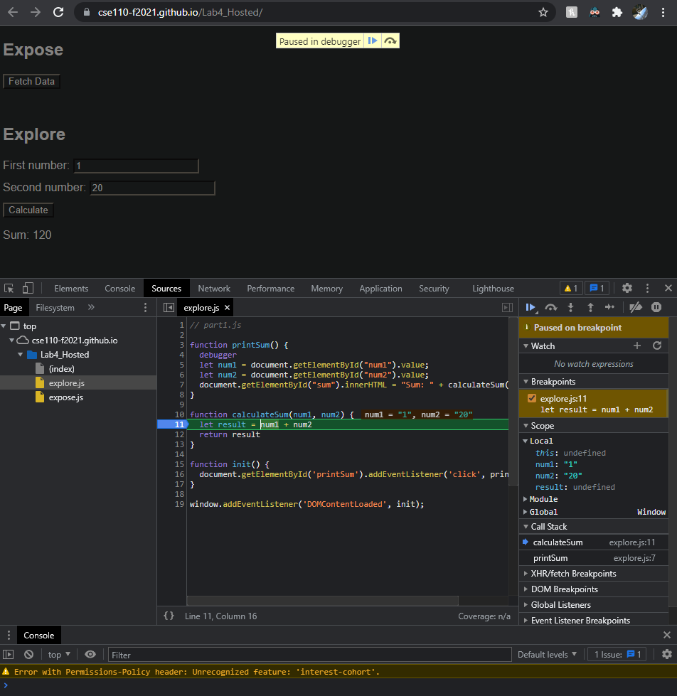
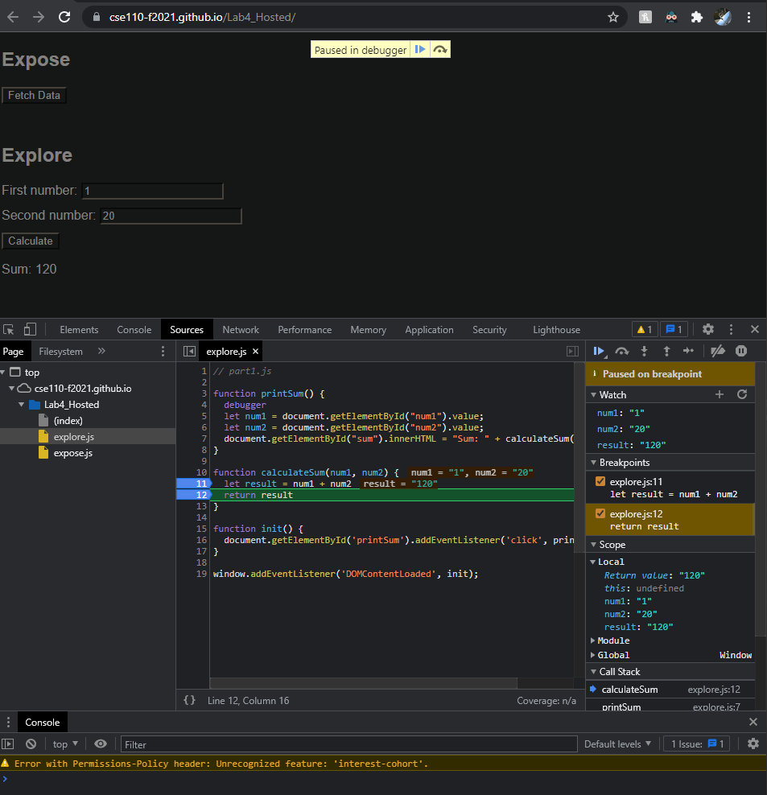
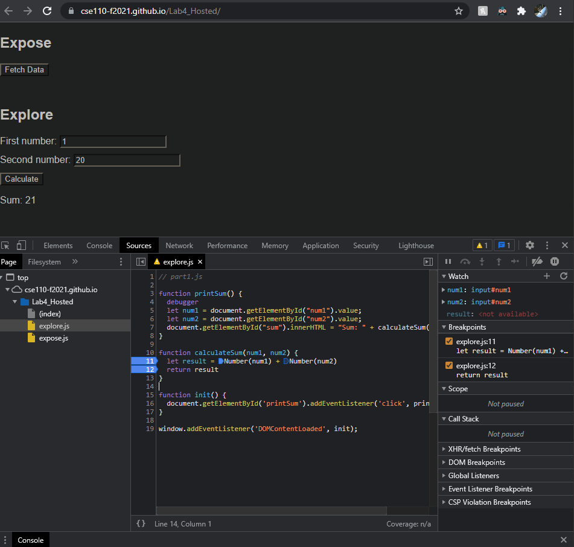

calculateSum
===============

dataType
===============

fix
===============

1. The bug concatenated the input numbers are strings rather than numbers. 
2. Fix by explicitly type casting the inputs as numbers. 